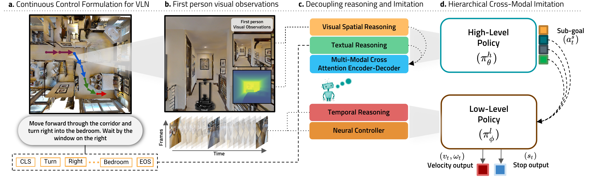

# Hierarchical Cross-Modal Agent for Robotics Vision-and-Language Navigation
 [](https://opensource.org/licenses/MIT) [](https://paperswithcode.com/sota/vision-and-language-navigation-on-robo-vln?p=hierarchical-cross-modal-agent-for-robotics-1)

This repository is the pytorch implementation of our paper:

**Hierarchical Cross-Modal Agent for Robotics Vision-and-Language Navigation**<br>
[__***Muhammad Zubair Irshad***__](https://zubairirshad.com), [Chih-Yao Ma](https://chihyaoma.github.io/), [Zsolt Kira](https://www.cc.gatech.edu/~zk15/) <br>
International Conference on Robotics and Automation (ICRA), 2021<br>

[[Project Page](https://zubair-irshad.github.io/projects/robo-vln.html)] [[arXiv](https://arxiv.org/abs/2104.10674)] [[GitHub](https://github.com/GT-RIPL/robo-vln)] 

<p align="center">

</p>

## Citation

If you find this repository useful, please cite our paper:

```
@inproceedings{irshad2021hierarchical,
  title={Hierarchical Cross-Modal Agent for Robotics Vision-and-Language Navigation},
  author={Muhammad Zubair Irshad and Chih-Yao Ma and Zsolt Kira},
  booktitle={Proceedings of the IEEE International Conference on Robotics and Automation (ICRA)},
  year={2021}
  }

@INPROCEEDINGS{irshad2022sasra,
        author={Irshad, Muhammad Zubair and Chowdhury Mithun, Niluthpol and Seymour, Zachary and Chiu, Han-Pang and Samarasekera, Supun and Kumar, Rakesh},
        booktitle={2022 26th International Conference on Pattern Recognition (ICPR)}, 
        title={Semantically-aware Spatio-temporal Reasoning Agent for Vision-and-Language Navigation in Continuous Environments}, 
        year={2022},
        volume={},
        number={},
        pages={4065-4071},
        keywords={Visualization;Three-dimensional displays;Navigation;Semantics;Natural languages;Transformers;Feature extraction},
        doi={10.1109/ICPR56361.2022.9956561}}
```

## Installation 

Clone the current repository and required submodules:

```bash
git clone https://github.com/GT-RIPL/robo-vln
cd robo-vln
  
export robovln_rootdir=$PWD
    
git submodule init 
git submodule update
```

### Habitat and Other Dependencies

Install `robo-vln` dependencies as follows:
```bash
conda create -n habitat python=3.6 cmake=3.14.0
cd $robovln_rootdir
python -m pip install -r requirements.txt
```

We use modified versions of [Habitat-Sim](https://github.com/facebookresearch/habitat-sim) and [Habitat-API](https://github.com/facebookresearch/habitat-lab) to support continuous control/action-spaces in Habitat Simulator. The details regarding continuous action spaces and converting discrete VLN dataset into continuous control formulation can be found in our [paper](https://arxiv.org/pdf/2104.10674.pdf). The specific commits of our modified [Habitat-Sim](https://github.com/facebookresearch/habitat-sim) and [Habitat-API](https://github.com/facebookresearch/habitat-lab) versions are mentioned below.

```bash	
# installs both habitat-api and habitat_baselines
cd $robovln_rootdir/environments/habitat-lab
python -m pip install -r requirements.txt
python -m pip install -r habitat_baselines/rl/requirements.txt
python -m pip install -r habitat_baselines/rl/ddppo/requirements.txt
python setup.py develop --all
	
# Install habitat-sim
cd $robovln_rootdir/environments/habitat-sim
python setup.py install --headless --with-cuda
```

### Data

Similar to [Habitat-API](https://github.com/facebookresearch/habitat-lab), we expect a `data` folder (or symlink) with a particular structure in the top-level directory of this project.

#### Matterport3D

We utilize Matterport3D (MP3D) photo-realistic scene reconstructions to train and evaluate our agent. A total of 90 Matterport3D scenes are used for `robo-vln`. Here is the official Matterport3D Dataset download link and associated instructions: [project webpage](https://niessner.github.io/Matterport/). To download the scenes needed for `robo-vln`, run the following commands:

```bash
# requires running with python 2.7
python download_mp.py --task habitat -o data/scene_datasets/mp3d/
```
Extract this data to `data/scene_datasets/mp3d` such that it has the form `data/scene_datasets/mp3d/{scene}/{scene}.glb`. 

#### Dataset

<p align="center">

</p>

The Robo-VLN dataset is a continuous control formualtion of the VLN-CE dataset by [Krantz et al](https://arxiv.org/pdf/2004.02857.pdf) ported over from Room-to-Room (R2R) dataset created by [Anderson et al](http://openaccess.thecvf.com/content_cvpr_2018/papers/Anderson_Vision-and-Language_Navigation_Interpreting_CVPR_2018_paper.pdf). The details regarding converting discrete VLN dataset into continuous control formulation can be found in our [paper](https://arxiv.org/pdf/2104.10674.pdf). 

| Dataset 	| Path to extract              	| Size  	|
|--------------	|----------------------------	|-------	|
| [robo_vln_v1.zip](https://www.dropbox.com/s/1e339avr84tfrbt/robo_vln_v1.zip?dl=1) 	| `data/datasets/robo_vln_v1`          	| 76.9 MB 	|

#### Robo-VLN Dataset

The dataset `robo_vln_v1` contains the `train`, `val_seen`, and `val_unseen` splits. 

* train: 7739 episodes
* val_seen: 570 episodes
* val_unseen: 1224 episodes

Format of `{split}.json.gz`

```
{
    'episodes' = [
        {
            'episode_id': 4991,
            'trajectory_id': 3279,
            'scene_id': 'mp3d/JeFG25nYj2p/JeFG25nYj2p.glb',
            'instruction': {
                'instruction_text': 'Walk past the striped area rug...',
                'instruction_tokens': [2384, 1589, 2202, 2118, 133, 1856, 9]
            },
            'start_position': [10.257800102233887, 0.09358400106430054, -2.379739999771118],
            'start_rotation': [0, 0.3332950713608026, 0, 0.9428225683587541],
            'goals': [
                {
                    'position': [3.360340118408203, 0.09358400106430054, 3.07817006111145], 
                    'radius': 3.0
                }
            ],
            'reference_path': [
                [10.257800102233887, 0.09358400106430054, -2.379739999771118], 
                [9.434900283813477, 0.09358400106430054, -1.3061100244522095]
                ...
                [3.360340118408203, 0.09358400106430054, 3.07817006111145],
            ],
            'info': {'geodesic_distance': 9.65537166595459},
        },
        ...
    ],
    'instruction_vocab': [
        'word_list': [..., 'orchids', 'order', 'orient', ...],
        'word2idx_dict': {
            ...,
            'orchids': 1505,
            'order': 1506,
            'orient': 1507,
            ...
        },
        'itos': [..., 'orchids', 'order', 'orient', ...],
        'stoi': {
            ...,
            'orchids': 1505,
            'order': 1506,
            'orient': 1507,
            ...
        },
        'num_vocab': 2504,
        'UNK_INDEX': 1,
        'PAD_INDEX': 0,
    ]
}
```
* Format of `{split}_gt.json.gz`

```
{
    '4991': {
        'actions': [
          ...
          [-0.999969482421875, 1.0],
          [-0.9999847412109375, 0.15731772780418396],
          ...
          ],
        'forward_steps': 325,
        'locations': [
            [10.257800102233887, 0.09358400106430054, -2.379739999771118],
            [10.257800102233887, 0.09358400106430054, -2.379739999771118],
            ...
            [-12.644463539123535, 0.1518409252166748, 4.2241311073303220]
        ]
    }
    ...
}
```
#### Depth Encoder Weights
Similar to [VLN-CE](https://arxiv.org/pdf/2004.02857.pdf), our learning-based models utilizes a depth encoder pretained on a large-scale point-goal navigation task i.e. [DDPPO](https://arxiv.org/abs/1911.00357). We utilize depth pretraining by using the DDPPO features from the ResNet50 from the original paper. The pretrained network can be downloaded [here](https://dl.fbaipublicfiles.com/habitat/data/baselines/v1/ddppo/ddppo-models.zip). Extract the contents of `ddppo-models.zip` to `data/ddppo-models/{model}.pth`.

## Training and reproducing results

### 
We use `run.py` script to train and evaluate all of our baseline models. Use `run.py` along with a configuration file and a run type (either `train` or `eval`) to train or evaluate:
```bash
python run.py --exp-config path/to/config.yaml --run-type {train | eval}
```
For lists of modifiable configuration options, see the default [task config](habitat_extensions/config/default.py) and [experiment config](robo_vln_baselines/config/default.py) files.

### Evaluating Models
All models can be evaluated using `python run.py --exp-config path/to/config.yaml --run-type eval`. The relevant config entries for evaluation are:

```bash
EVAL_CKPT_PATH_DIR  # path to a checkpoint or a directory of checkpoints
EVAL.USE_CKPT_CONFIG  # if True, use the config saved in the checkpoint file
EVAL.SPLIT  # which dataset split to evaluate on (typically val_seen or val_unseen)
EVAL.EPISODE_COUNT  # how many episodes to evaluate
```
If `EVAL.EPISODE_COUNT` is equal to or greater than the number of episodes in the evaluation dataset, all episodes will be evaluated. If `EVAL_CKPT_PATH_DIR` is a directory, one checkpoint will be evaluated at a time. If there are no more checkpoints to evaluate, the script will poll the directory every few seconds looking for a new one. Each config file listed in the next section is capable of both training and evaluating the model it is accompanied by.


### Off-line Data Buffer
All our models require an off-line data buffer for training. To collect the continuous control dataset for both `train` and `val_seen` splits, run the following commands before training (Please note that it would take some time on a single GPU to store data. Please also make sure to dedicate around ~1.5 TB of hard-disk space for data collection):

`Collect data buffer for train split:`
```bash
python run.py --exp-config robo_vln_baselines/config/paper_configs/robovln_data_train.yaml --run-type train
```

`Collect data buffer for val_seen split:`
```bash
python run.py --exp-config robo_vln_baselines/config/paper_configs/robovln_data_val.yaml --run-type train 
```

### CUDA
We use 2 GPUs to train our Hierarchical Model [hierarchical_cma.yaml](robo_vln_baselines/config/paper_configs/hierarchical_cma.yaml). To train the hierarchical model, dedicate 2 GPUs for training as follows:

```bash
CUDA_VISIBLE_DEVICES=0,1 python run.py --exp-config robo_vln_baselines/config/paper_configs/hierarchical_cma.yaml --run-type train
```

## Models/Results From the Paper

| Model              | val_seen SPL | val_unseen SPL | Config                                                                                                                                                                                   |
|--------------------|--------------|----------------|------------------------------------------------------------------------------------------------------------------------------------------------------------------------------------------|
| Seq2Seq            | 0.34         | 0.30           | [seq2seq_robo.yaml](robo_vln_baselines/config/paper_configs/seq2seq_robo.yaml)                                                                                                                        |
| PM                 | 0.27         | 0.24           | [seq2seq_robo_pm.yaml](robo_vln_baselines/config/paper_configs/seq2seq_robo_pm.yaml)                                                                                                                  |
| CMA                | 0.25         | 0.25           | [cma.yaml](robo_vln_baselines/config/paper_configs/cma.yaml)                                                                                                                  |
| **HCM (Ours)**     | 0.43         | 0.40           | [hierarchical_cma.yaml](robo_vln_baselines/config/paper_configs/hierarchical_cma.yaml)                                                                                                                  |


|         |  Legend                                                                                                                                               |
|---------|-------------------------------------------------------------------------------------------------------------------------------------------------------|
| Seq2Seq | [Sequence-to-Sequence](https://github.com/jacobkrantz/VLN-CE). Please see our [paper](https://arxiv.org/pdf/2104.10674.pdf) on modification made to the model to match the continuous action spaces in robo-vln                                                                                                                                                          |
| PM      | [Progress monitor](https://github.com/chihyaoma/selfmonitoring-agent)                                                                                 |
| CMA     | [Cross-Modal Attention model](https://github.com/jacobkrantz/VLN-CE). Please see our [paper](https://arxiv.org/pdf/2104.10674.pdf) on modification made to the model to match the continuous action spaces in robo-vln                                                                                                                                                          |
| **HCM**     | Hierarchical Cross-Modal Agent Module (The proposed hierarchical VLN model from our [paper](https://arxiv.org/pdf/2104.10674.pdf)).                                                                                                                                                                 |

### Pretrained Model

We provide pretrained model for our best Hierarchical Cross-Modal Agent ([HCM](https://www.dropbox.com/s/4v8bqks7a8jgjzz/HCM_Agent.pth?dl=1)). Pre-trained Model can be downloaded as follows:

| Pre-trained Model 	| Size  	|
|--------------	|-------	|
| [HCM_Agent.pth](https://www.dropbox.com/s/4v8bqks7a8jgjzz/HCM_Agent.pth?dl=1) 	| 691 MB 	|

## Acknowledgments
* This code is built upon the implementation from [VLN-CE](https://github.com/jacobkrantz/VLN-CE)
